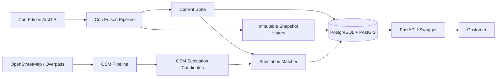

# MeanderX

## Overview

MeanderX ingests Con Edison hosting-capacity data, stores it in PostgreSQL/PostGIS, and exposes stable customer APIs for feeders, substations, hosting capacity, geometry, queue availability, historical snapshots, and change detection.

The upstream ArcGIS source represents current state. MeanderX preserves historical snapshots locally so customers can see how feeder hosting-capacity data changes over time.

## Quick Start

The primary reviewer command is:

```bash
./run.sh
```

Default mode is deterministic demo mode. It builds Docker images, starts PostGIS, applies migrations, seeds fixture data, starts FastAPI, and prints useful URLs.

Reviewer URLs:

```text
Frontend: http://localhost:4200
API: http://localhost:8000
Swagger: http://localhost:8000/docs
```

Demo IDs:

```text
Feeder: DEMO-F1
Substation: DEMO-SUB-A
```

## Architecture



## Demo Mode

Demo mode avoids external dependencies and is safe for review:

```bash
APP_MODE=demo ./run.sh
```

It creates deterministic fixture data showing:

- feeder lookup
- hosting capacity
- feeder geometry
- substation lookup
- substation feeders
- queue unavailable behavior
- historical snapshots
- change detection
- OSM geometry enrichment and provenance

Demo fixtures are explicitly seeded through `python -m app.cli demo seed`; they are not mixed into live ingestion.

## Frontend Explorer

The Angular frontend is a standalone visual layer for reviewers and non-domain users:

```text
http://localhost:4200
```

Pages:

- **Overview** shows mode, counts, latest ingestion runs, source capabilities, and the pipeline lifecycle.
- **Feeders** searches customer-facing feeder data and displays hosting capacity, geometry, source timestamp, and queue availability.
- **Substations** shows substation details, connected feeders, and OSM geometry enrichment/provenance where available.
- **History** shows immutable feeder snapshots and detected changes.
- **Architecture** explains how Con Edison ArcGIS, OSM, PostGIS, FastAPI, and the Angular customer app fit together.

The frontend calls only FastAPI domain endpoints. It does not expose ArcGIS query syntax or raw source structures.

## Live Mode

Live mode uses external sources:

```bash
APP_MODE=live ./run.sh
```

Before running live mode, edit `.env`:

```env
ARC_GIS_ENDPOINT=<real Con Edison FeatureServer layer URL>
OSM_OVERPASS_URL=https://overpass-api.de/api/interpreter
OSM_BBOX=40.4774,-74.2591,40.9176,-73.7004
OSM_MATCH_THRESHOLD=0.72
```

If OSM ingestion is unavailable, the script reports that clearly and leaves the core Con Edison API available.

After live mode starts, open:

```text
Frontend: http://localhost:4200
Swagger: http://localhost:8000/docs
```

Live mode may take longer because the Con Edison layer can contain many ArcGIS features that normalize down to fewer unique customer feeders.

## CLI

```bash
python -m app.cli ingest conedison
python -m app.cli ingest osm
python -m app.cli ingest all
python -m app.cli demo seed
python -m app.cli api
```

## API Examples

Get platform summary for the frontend:

```bash
curl "http://localhost:8000/api/v1/system/summary"
```

Search feeders:

```bash
curl "http://localhost:8000/api/v1/feeders?feederId=DEMO&limit=20&offset=0"
```

Get a feeder:

```bash
curl "http://localhost:8000/api/v1/feeders/DEMO-F1"
```

Get queue information:

```bash
curl "http://localhost:8000/api/v1/feeders/DEMO-F1/queue"
```

Get feeder history:

```bash
curl "http://localhost:8000/api/v1/feeders/DEMO-F1/history"
```

Get feeder changes:

```bash
curl "http://localhost:8000/api/v1/feeders/DEMO-F1/changes"
```

Get a substation:

```bash
curl "http://localhost:8000/api/v1/substations/DEMO-SUB-A"
```

List feeders connected to a substation:

```bash
curl "http://localhost:8000/api/v1/substations/DEMO-SUB-A/feeders"
```

## Historical Data

Successful changed ingestions create immutable snapshot rows:

- `feeders` and `substations` hold current state.
- `feeder_snapshots` and `substation_snapshots` hold historical state.
- `ingestion_runs.dataset_hash` stores a deterministic SHA-256 hash of normalized domain values sorted by feeder ID.
- Identical datasets are marked `UNCHANGED` and do not create duplicate snapshots.
- Failed ingestions do not create valid snapshots.

## OSM Enrichment

OpenStreetMap substations are ingested from bounded Overpass queries using `power=substation`. OpenInfraMap is documented as a visualization of OSM infrastructure data, not a runtime dependency.

The matcher stores:

- Con Edison substation
- OSM substation
- confidence score from 0 to 1
- match method
- distance where available
- accepted/rejected decision

Low-confidence or ambiguous matches remain unresolved. Accepted matches expose `geometrySource` in the substation API.

## Pipeline Design

Pipelines follow a lightweight lifecycle:

```text
extract -> validate -> transform -> load
```

Source-specific behavior lives under `app/pipelines/conedison` and `app/pipelines/osm`. API handlers use service and repository layers rather than direct source or SQL logic.

## Testing

Run the complete test and quality command:

```bash
./scripts/test.sh
```

Equivalent core test command:

```bash
docker-compose run --rm app pytest -q
```

## Limitations

- The Con Edison queue count is not invented because the hosting-capacity source does not expose enough queue/project data.
- Live ingestion depends on the configured ArcGIS endpoint and internet availability.
- OSM matching depends on community-maintained tags and may miss substations with weak names/operators.
- Feeder geometry proximity helps matching but is evidence, not proof.
- There is no authentication or rate limiting in this assessment build.

## What I Would Do With More Time

- Scheduled ingestion with orchestration.
- Exponential backoff and richer retry telemetry.
- Raw source payload archiving in object storage.
- API authentication and rate limiting.
- Monitoring, alerting, and ingestion notifications.
- Manual OSM match review/override workflow.
- CI/CD and cloud deployment.
- Partitioning or retention policies for long historical timelines.
