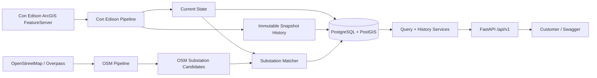

# Architecture

## System Context



## Components

- FastAPI: stable customer API contracts and Swagger documentation.
- Con Edison pipeline: extracts ArcGIS feeder data, validates it, maps it to domain state, and writes current plus historical records.
- OSM pipeline: extracts bounded `power=substation` records, normalizes tags and geometry, and stores enrichment candidates.
- Substation matcher: compares Con Edison substations with OSM candidates using name, operator, and proximity signals.
- PostgreSQL/PostGIS: stores current state, historical snapshots, OSM candidates, match provenance, and spatial indexes.

## Pipeline Lifecycle

```text
extract -> validate -> transform -> load
```

Loads are transactional. Failed ingestions are recorded but do not replace current state or create valid snapshots.

## Persistence Model

- `feeders`, `substations`: current state for customer queries.
- `ingestion_runs`: audit trail, status, counts, dataset hash, and snapshot metadata.
- `feeder_snapshots`, `substation_snapshots`: immutable history per successful changed ingestion.
- `osm_substations`: normalized OSM enrichment candidates.
- `substation_osm_matches`: confidence-scored matching provenance.

## Current State vs History

Current-state tables are updated for fast lookups. Snapshot tables are append-only so previous captured source states remain queryable even though the upstream endpoint overwrites old data.

Identical normalized datasets are marked `UNCHANGED`; the ingestion attempt is recorded but duplicate snapshot rows are skipped.

## OSM Enrichment Flow

OSM enrichment does not overwrite Con Edison identity. Accepted OSM matches provide source-independent substation geometry and expose provenance through `geometrySource`.

Weak or ambiguous matches remain unresolved, leaving substation geometry nullable.

## Failure Behavior

- Empty/invalid Con Edison ingestions fail safely.
- Failed loads roll back transactional writes.
- OSM failure in live one-command mode is reported without making the core Con Edison API unavailable.
- Public API errors are customer-friendly and avoid exposing database traces.
