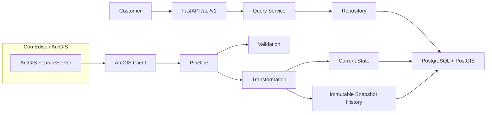

# Architecture

The public API exposes stable domain contracts for feeders, substations, geometry, hosting capacity, and queue availability. ArcGIS query syntax and raw source attributes stay inside the ingestion/client layers.

Historical capture is owned by ingestion because the source endpoint overwrites current data. Each successful changed ingestion stores current state and snapshot state transactionally. Identical normalized datasets are recorded as unchanged ingestion attempts without duplicating snapshot rows.
